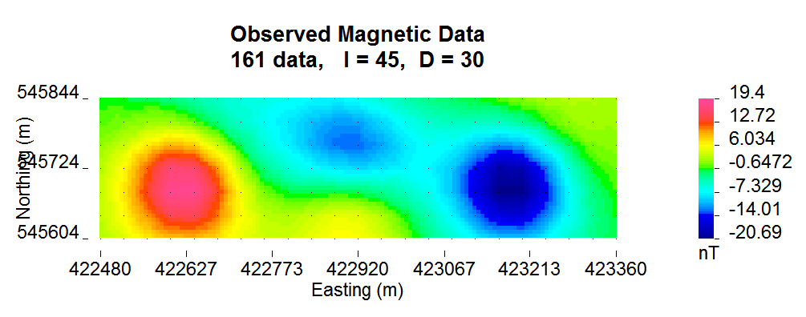
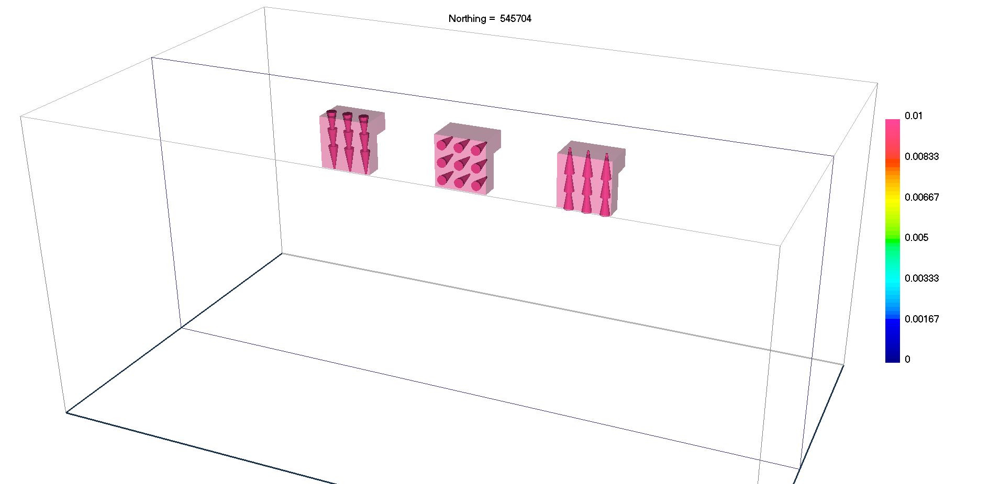
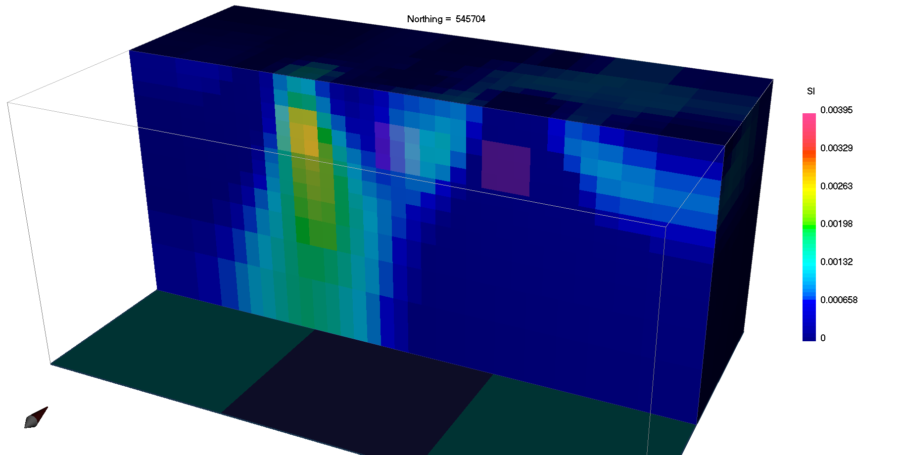
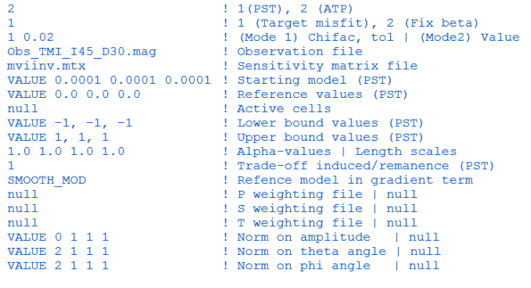

.. _examples:

Examples
========

In this section, we present a simple synthetic example to illustrate forward
modelling and inversion of magnetic vector models. For more in-depth training
material, please visit our `AtoZ example <http://giftoolscookbook.readthedocs.io/en/latest/content/AtoZ/magnetic/index.html>`_ .

The example is made up of three magnetic block, 120 m in side length, placed 85
meters below a grid of observation points. The blocks are magnetized along
different directions, indicating the effects of remanent magnetization are large.

The example, including the model and simulated data, can be `downloaded
here <https://github.com/ubcgif/mvi/raw/v3/examples/TripleBlocks.zip>`_.

Susceptibility Inversion
^^^^^^^^^^^^^^^^^^^^^^^^

To demonstrate the importance of accounting for remanence, we first assume all magnetization is induced and invert the data using the `MAG3D <http://mag3d.readthedocs.io/en/latest/>`_
inversion program. Below we see that the final magnetic susceptibility model clearly fails
to recover the shape and location of the three magnetic blocks.

Magnetic Vector Inversion
^^^^^^^^^^^^^^^^^^^^^^^^^

In order to properly account for arbitrary orientations of magnetization, the data are re-inverted with the MVI algorithm using the input file shown below.
Plotted are a smooth solution recovered using the :ref:`Cartesian formulation<MVIC>` and a sparse solution recovered using the :ref:`Spherical formulation<MVIS>`

Comparing the results we note that:

 - The smooth solution (MVI-Cartesian) imaged all three blocks at the correct locations and the magnetization directions at the center of each block are well recovered. The center block is much more difficult to identify.
 - The sparse solution (MVI-Spherical) greatly simplified the magnetization model and highlighted the presence of the center block anomaly.

.. raw:: html
    :file: ./BlockExample.html

