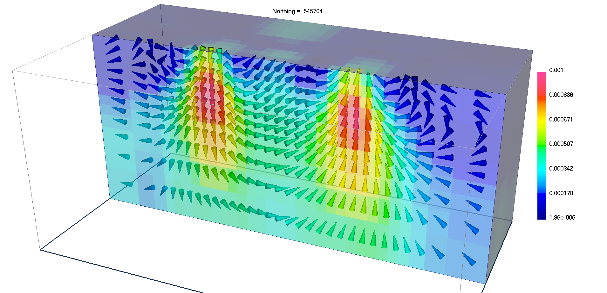
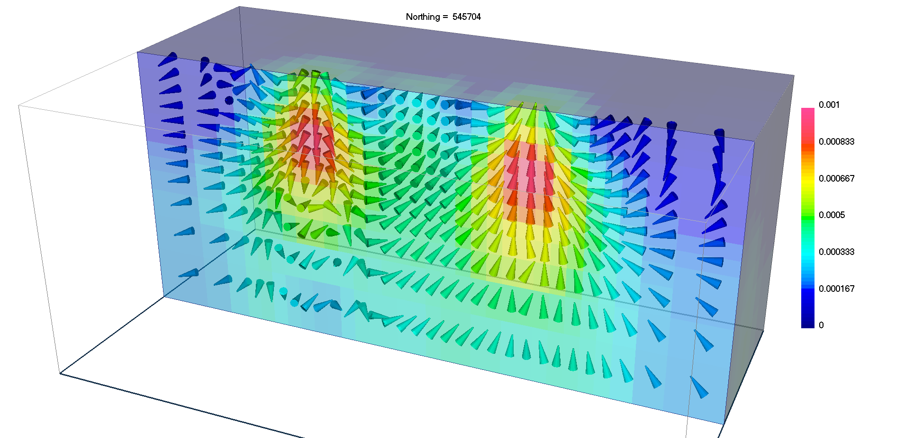
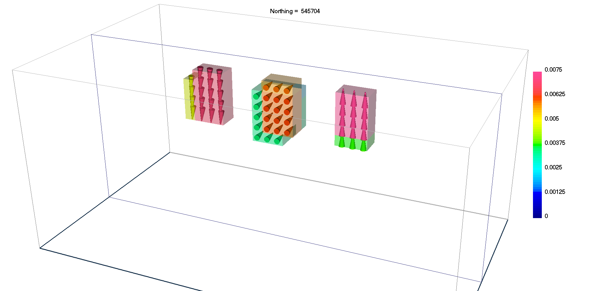
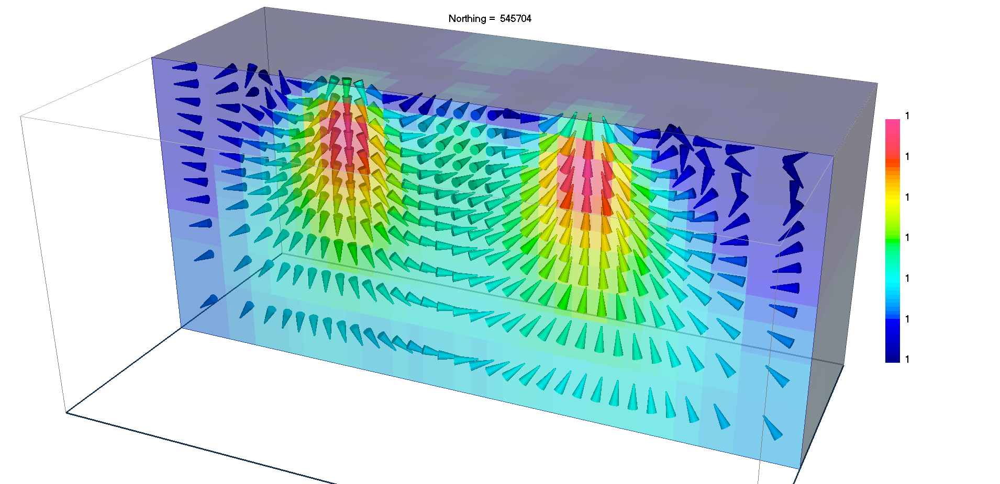
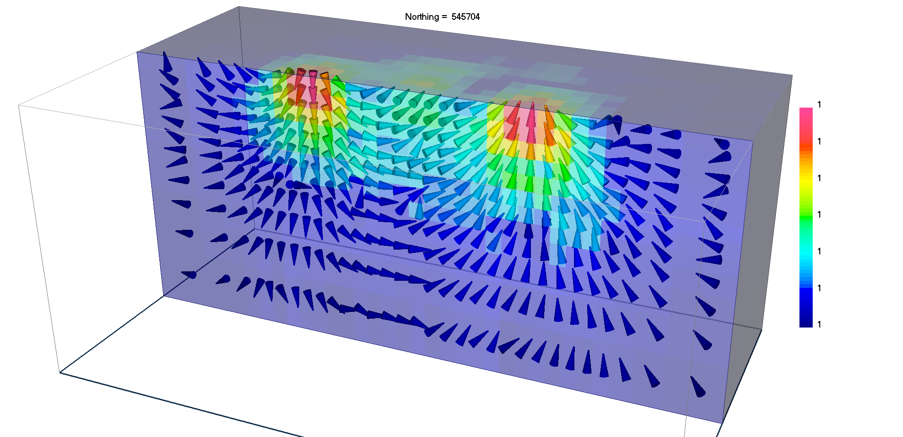

.. _overview:

MVI Package Overview
====================

The magnetic vector inversion (MVI) package is a program library for carrying out 3D forward modelling and inversion
of magnetic data for the full magnetization vector.
The program library is comprised of the following executables:

#. :ref:`MVIFWD<mvifwd>`: Forward modelling of the magnetic anomaly response for a 3D
   distribution of magnetized volumes.

#. :ref:`MVIINV<mviinv>`: Performs the 3D magnetic vector inversion for magnetic anomaly data. The model is defined on a mesh of rectangular cells and is comprised of the effective susceptibilities in 3 orthogonal directions for each cell.

#. :ref:`MVISEN<mvisen>`: Calculates the sensitivities for the inversion.

.. note:: -  This code recovers the total magnetization vector in terms of effective susceptibility.
          -  The code models the combined contribution of induced fields (susceptibility), self-demagnetization and remenance.
          -  Inversion can be carried out in Cartesian (p,s,t) and Spherical (a,t,p) coordinate systems, but sparsity constraints can only be applied on the Spherical (atp) formulation.

Licensing
---------

Licensing for an unconstrained academic version is available - see the `Licensing policy document <http://gif.eos.ubc.ca/software/licenses>`__.

**NOTE:** All academic licenses will be **time-limited to one year**. You can re-apply after that time. This ensures that everyone is using the most recent versions of codes.

Licensing for commercial use is managed by third party distributors. Details are in the `Licensing policy document <http://gif.eos.ubc.ca/software/licenses>`__.

Installing
----------

There is no automatic installer currently available for this package. Please carry out the following steps in order to use the software:

#. Extract all files provided from the given zip-based archive and place them all together in a new folder

#. Add the path to the new folder to your environment variables.

Two additional notes about installation:

-  Do not store anything in the "bin" directory other than executable applications and Graphical User Interface applications (GUIs).

Highlights of changes from version 2.0
--------------------------------------

    - Distance weights are calculated directly from the sensitivity matrix; as a result, the user is no longer required to run the PFWEIGHT program.
    - Length scales used in differential operators are set internally based on the mesh cell dimensions. **The default values for** :math:`\boldsymbol{\alpha_s}` **is now 1.**
    - An approximated sensitivity calculation is now used to speed up the code for the MVI-Spherical formulation.
    - Compression of the sensitivities both the MVI-Cartesian and MVI-Spherical formulations is now available. Default threshold tolerances are determined iteratively, and favoring lowest compression error.

.. raw:: html
    :file: ./BlockVersions.html

.. note:: Download this `Three Blocks Example <https://github.com/ubcgif/mvi/raw/v3/examples/TripleBlocks.zip>`_

.. figure:: ../images/True.png
    :align: right
    :figwidth: 0%

