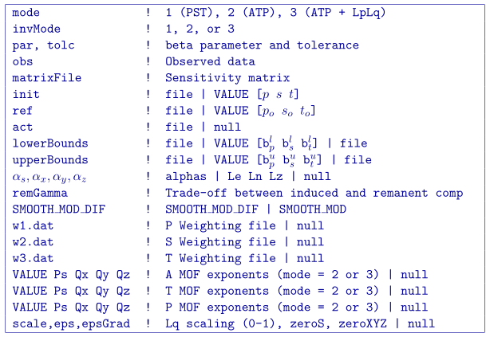

.. _mviinv:

MVIINV
======

This program performs the 3D inversion of magnetic data to recover magnetic vectors as effective susceptibilities. The command line syntax for running this code is:

``mviinv mviinv.inp [nThreads]``

For a sample input file type:

``mviinv -inp``

The argument specifying the number of CPU threads used in the OpenMP format is optional. If this argument is not given to the program, chooses to use all of the CPU threads on the machine. This argument allows the user to specify half, for example, of the threads so that the program does not take all available RAM. Note that this option is not available in the MPI-based code used for clusters.

Input files
-----------

Input files can be given any name. If there are spaces in the path or file name, you *MUST* use quotes around the entire path (including the filename).

The input file contains the following elements. An example file can be `copied from here <https://github.com/ubcgif/mvi/raw/v3/examples/mviinv.inp>`_ .

+----+-------------------------------+------------------------------------------------------------------------------------------------------------------------------------------------------------------+
|Line|  Input                        |  Description                                                                                                                                                     |
+====+===============================+==================================================================================================================================================================+
|1   |  :ref:`mode<mode>`            | 1(PST), 2 (ATP)                                                                                                                                                  |
+----+-------------------------------+------------------------------------------------------------------------------------------------------------------------------------------------------------------+
|2   |:ref:`invMode<invMode>`        | 1 (Target misfit), 2 (Fix beta)                                                                                                                                  |
+----+-------------------------------+------------------------------------------------------------------------------------------------------------------------------------------------------------------+
|3   |:ref:`par, tolc<par>`          | (Mode 1) Chifac, tol | (Mode2) Value                                                                                                                             |
+----+-------------------------------+------------------------------------------------------------------------------------------------------------------------------------------------------------------+
|4   |:ref:`obs<obs>`                | `Observations file <http://giftoolscookbook.readthedocs.io/en/latest/content/fileFormats/magfile.html>`_                                                         |
+----+-------------------------------+------------------------------------------------------------------------------------------------------------------------------------------------------------------+
|5   |:ref:`matrixFile<matrixFile>`  | Sensitivity matrix file from :ref:`mvisen`                                                                                                                       |
+----+-------------------------------+------------------------------------------------------------------------------------------------------------------------------------------------------------------+
|6   |:ref:`init<init>`              | Starting `vector model file <http://giftoolscookbook.readthedocs.io/en/latest/content/fileFormats/modelVectorfile.html>`_ | VALUE [p s t]                        |
+----+-------------------------------+------------------------------------------------------------------------------------------------------------------------------------------------------------------+
|7   |:ref:`ref<ref>`                | Reference `Vector model file <http://giftoolscookbook.readthedocs.io/en/latest/content/fileFormats/modelVectorfile.html>`_ | VALUE [p s t]                       |
+----+-------------------------------+------------------------------------------------------------------------------------------------------------------------------------------------------------------+
|8   |:ref:`act<act>`                | `Active model file <http://giftoolscookbook.readthedocs.io/en/latest/content/fileFormats/modelfile.html>`_ | null                                                |
+----+-------------------------------+------------------------------------------------------------------------------------------------------------------------------------------------------------------+
|9   |:ref:`lowerBounds<lowerBounds>`| Lower bound `vector model file <http://giftoolscookbook.readthedocs.io/en/latest/content/fileFormats/modelVectorfile.html>`_ | VALUE :math:`[b^l_p b^l_s b^l_t]` |
+----+-------------------------------+------------------------------------------------------------------------------------------------------------------------------------------------------------------+
|10  |:ref:`upperBounds<upperBounds>`| Upper bound `vector model file <http://giftoolscookbook.readthedocs.io/en/latest/content/fileFormats/modelVectorfile.html>`_ | VALUE :math:`[b^u_p b^u_s b^u_t]` |
+----+-------------------------------+------------------------------------------------------------------------------------------------------------------------------------------------------------------+
|11  |:ref:`scalings<alpha>`         | :math:`\alpha_s \alpha_x \alpha_y \alpha_z` | Lx Ly Lz | null                                                                                                    |
+----+-------------------------------+------------------------------------------------------------------------------------------------------------------------------------------------------------------+
|12  |:ref:`remGamma<remGamma>`      | Trade-off induced/remanence (PST)                                                                                                                                |
+----+-------------------------------+------------------------------------------------------------------------------------------------------------------------------------------------------------------+
|13  |:ref:`SMOOTH_MOD<SMOOTH_MOD>`  | Refence model in gradient term                                                                                                                                   |
+----+-------------------------------+------------------------------------------------------------------------------------------------------------------------------------------------------------------+
|14  |:ref:`w1.dat<weights>`         |   P `weighting file <http://giftoolscookbook.readthedocs.io/en/latest/content/fileFormats/modelfile.html>`_ | null                                               |
+----+-------------------------------+------------------------------------------------------------------------------------------------------------------------------------------------------------------+
|15  |:ref:`w2.dat<weights>`         |  S `weighting file <http://giftoolscookbook.readthedocs.io/en/latest/content/fileFormats/modelfile.html>`_ | null                                                |
+----+-------------------------------+------------------------------------------------------------------------------------------------------------------------------------------------------------------+
|16  |:ref:`w3.dat<weights>`         |  T `weighting file <http://giftoolscookbook.readthedocs.io/en/latest/content/fileFormats/modelfile.html>`_ | null                                                |
+----+-------------------------------+------------------------------------------------------------------------------------------------------------------------------------------------------------------+
|17  |:ref:`VALUE Ps Px Py Pz<norms>`| Norm on amplitude   | null                                                                                                                                       |
+----+-------------------------------+------------------------------------------------------------------------------------------------------------------------------------------------------------------+
|18  |:ref:`VALUE Ps Px Py Pz<norms>`| Norm on theta angle | null                                                                                                                                       |
+----+-------------------------------+------------------------------------------------------------------------------------------------------------------------------------------------------------------+
|19  |:ref:`VALUE Ps Px Py Pz<norms>`| Norm on phi angle   | null                                                                                                                                       |
+----+-------------------------------+------------------------------------------------------------------------------------------------------------------------------------------------------------------+

Download example here:

The parameters within the control file are:

.. _mode:

-  ``mode``: An integer specifying one of three choices on which solution the inversion will solve:

   #. ``mode=1``: the program solves the vector problem in the **P,S,T** (Cartesian) space where *P* is the inducing field direction and *S* and *T* are its orthogonal components.

   #. ``mode=2``: the program solves the vector problem in the **A,T,P** (Spherical) space where *A* is the amplitude (i.e., effective susceptibility), *T* is the theta angle, and *P* is the psi angle.

   #. ``mode=3``: the program solves the vector problem in the **A,T,P** (Spherical) and then uses the last four lines of the input file to solve the Lp/Lq problem for compactness/blockiness.

.. _invmode:

-  ``invMode``: An integer specifying one of three choices for determining the trade-off parameter.

   #. ``invMode=1``: the program chooses the trade off parameter by carrying out a line search so that the target value of data misfit is achieved (e.g., :math:`\phi_d^*=N`).

   #. ``invMode=2``: the user inputs the trade-off parameter (``par``).

   #. ``invMode=3``: The user gives the trade-off parameter (``par``) and the initial model  from an **A,T,P** L2 inversion (``mode=2``) is used (and required) and the program will automatically go to the Lp/Lq solves. *This mode only runs the A,T,P formulation for Lp/Lq.*

.. _par:

- ``par``, ``tolc`` Two real numbers that are dependent upon the value of ``mode``.

   #. ``mode=1``: the target misfit value is given by the product of ``par`` and the number of data :math:`N` , i.e., ``par=1`` is equivalent to :math:`\phi_d^*=N` and ``par=0.5`` is equivalent to :math:`\phi_d^*=N/2` . The second parameter, ``tolc``, is the misfit tolerance in fractional percentage. The target misfit is considered to be achieved when the relative difference between the true and target misfits is less than ``tolc``. Normally, ``par=1`` is ideal if the true standard deviation of error is assigned to each datum. When ``tolc=0``, the program assumes a default value of ``tolc=0.02`` since this number must be positive.

   #. ``invMode=2``: ``par`` is the user-input value of trade off parameter. In this case, ``tolc`` is not used by the program.

   #. ``invMode=3``: ``par`` is the user-input value of trade off parameter and ``tolc`` is the misfit tolerance in fractional percentage.

   | **NOTE:** When both ``par`` and ``tolc`` are used. When only ``par`` is used. When ``mode=3``, neither nor ``tolc`` are used. However, the third line should always have two values.

.. _obs:

-  ``obs``: Input `data file <http://giftoolscookbook.readthedocs.io/en/latest/content/fileFormats/magfile.html>`_. The file must specify the standard deviations of the error. By definition these values are greater than zero.

.. _matrixFile:

-  ``matrixFile``: The binary file containing the sensitivities created by :ref:`mvisen`.

.. _init:

-  ``init``: The initial magnetization `vector model <http://giftoolscookbook.readthedocs.io/en/latest/content/fileFormats/modelVectorfile.html>`_ in **P,S,T** mode. Values can be defined as a value for uniform models (e.g. ``VALUE 0.001 0.001 0.001``), or by a filename. There must be three values (P,S,T) if this option is used. Each component must be within the upper and lower bounds.

.. _ref:

-  ``ref``: The reference magnetization `vector model <http://giftoolscookbook.readthedocs.io/en/latest/content/fileFormats/modelVectorfile.html>`_ in **P,S,T** mode. Values can be defined as a value for uniform models (e.g. ``VALUE 0 0 0``), or by a filename. There must be three values (P,S,T) if this option is used. Each component must be within the upper and lower bounds.

.. _act:

- ``act``: The `active model file <http://giftoolscookbook.readthedocs.io/en/latest/content/fileFormats/modelfile.html>`_ defining which cells in the model are allowed to be solved.

.. _lowerBounds:

- ``lowerBounds``: The reference magnetization `vector model <http://giftoolscookbook.readthedocs.io/en/latest/content/fileFormats/modelVectorfile.html>`_ in **P,S,T** mode. Values can be defined as a value for uniform models (e.g. ``VALUE -1 -1 -1``), or by a filename. There must be three values (P,S,T) if this option is used. For example, a P value of -1 is a magnetization reverse to the inducing field with an amplitude of 1 SI.

.. _upperBounds:

- ``upperBounds``: The reference magnetization `vector model <http://giftoolscookbook.readthedocs.io/en/latest/content/fileFormats/modelVectorfile.html>`_ in **P,S,T** mode. Values can be defined as a value for uniform models (e.g. ``VALUE 1 1 1``), or by a filename. There must be three values (P,S,T) if this option is used. For example, a P value of 1 is a magnetization in the inducing field direction with an amplitude of 1 SI.

.. _alpha:

- :math:`\alpha_s, \alpha_x, \alpha_y, \alpha_z`: Coefficients for the each model component. :math:`\alpha_s` is the smallest model component. :math:`\alpha_x` is the coefficient for the derivative in the easting direction. :math:`\alpha_y` is the coefficient for the derivative in the northing direction. The coefficient :math:`\alpha_z` is for the derivative in the vertical direction.

   If ``null`` is entered on this line, then the above four parameters take the following default values:  :math:`\alpha_s = \alpha_x = \alpha_y = \alpha_z = 1`. All alphas must be positive and they cannot be all equal to zero at the same time.

   **NOTE:** The four coefficients in line 9 of the control file may be substituted for three corresponding *length scales* :math:`L_x, L_y` and :math:`L_z` and are in units of metres. They generally define smoothness of the recovered model in each direction. Larger ratios result in smoother models, smaller ratios result in blockier models. Internally, the length scales are converted back to :math:`\alpha`-values such that:

   .. math::

      \label{eq:lengths}
      \alpha_s = \left(\frac{1}{L}\right)^2 ; \alpha_x = \left(\frac{L_x}{L}\right)^2; \alpha_y = \left(\frac{L_y}{L}\right)^2 ; \alpha_z = \left(\frac{L_z}{L}\right)^2

   where :math:`L = max[L_x, L_y, L_z]`. When user-defined, it is preferable to have length scales exceed the corresponding cell dimensions.

.. _remGamma:

- ``remGamma``: This is a number that places (de-)emphasis on the remenant magnetization components (and extra scaling of **S,T** compents versus **P**). If ``null`` is chosen, the trade-off between induced and remanent components are all 0.5. The higher the number, the stronger the inversion will try to recover an induced magnetization model.

.. _SMOOTH_MOD:

- ``SMOOTH_MOD``: This option was not available in previous versions of the code and can be used to define the reference model in and out of the derivative terms. The options are: ``SMOOTH_MOD_DIF`` (reference model is defined in the derivative terms) and ``SMOOTH_MOD`` (reference model is defined in only the smallest term). See equation :eq:`mof` for details.

.. _weights:

- ``w1.dat``: Name of the `weights file <http://giftoolscookbook.readthedocs.io/en/latest/content/fileFormats/modelfile.html>`_ containing weighting matrices for the *P* component. If ``null`` is entered, default values of unity are used.

- ``w2.dat``: Name of the `weights file <http://giftoolscookbook.readthedocs.io/en/latest/content/fileFormats/modelfile.html>`_ containing weighting matrices for the *S* component. If ``null`` is entered, default values of unity are used.

- ``w3.dat``: Name of the `weights file <http://giftoolscookbook.readthedocs.io/en/latest/content/fileFormats/modelfile.html>`_ containing weighting matrices for the *T* component. If ``null`` is entered, default values of unity are used.

.. _norms:

- ``VALUE Ps Qx Qy Qz``: The Lp/Lq exponents for the **magnetization amplitude** (A). *The mode must be 2 or 3 and this line is not required if mode=1.* ``null`` makes :math:`P=Q_x=Q_y=Q_z=2`. P works on the smallest model component and Qs are on the spatial components of the model objective function.

- ``VALUE Ps Qx Qy Qz``: The Lp/Lq exponents for the **theta angle** (T: polar angle positive down). The Lp constant is ignored. *The mode must be 2 or 3 and this line is not required if mode=1.*  ``null`` makes :math:`P=Q_x=Q_y=Q_z=2`. Qs are on the spatial components of the model objective function.

- ``VALUE Ps Qx Qy Qz``: The Lp/Lq exponents for the **phi angle** (P: zenith angle). The Lp constant is ignored. *The mode must be 2 or 3 and this line is not required if mode=1.*  ``null`` makes :math:`P=Q_x=Q_y=Q_z=2`. Qs are on the spatial components of the model objective function.

    **NOTE**: This line is only incorporated for the amplitude. The smallest model component is turned off for the Lp with the two angles, theta and phi. The gradient effective zero is set to two and five degrees for theta and phi, respectively.

Output files
------------

Seven general output files are created by the inversion. They are:

#. ``mviinv.log``: The log file containing the minimum information for each iteration and summary of the inversion.

#. ``mviinv.out``: The "developers" log file containing the details of each iteration including the model objective function values for each component, number of conjugate gradient iterations, etc.

#. ``mviinv_xxx.amp``: Amplitude of the recovered model  (ie effective susceptibility) for the "xxx" iteration in an `model file <http://giftoolscookbook.readthedocs.io/en/latest/content/fileFormats/modelfile.html>`_ format (e.g., "mviinv_004.amp").

#. ``mviinv_xxx.rem``: Remanent component of the recovered model for the "xxx" iteration in an `model file <http://giftoolscookbook.readthedocs.io/en/latest/content/fileFormats/modelfile.html>`_ format

#. ``mviinv_xxx.ind``: Induced component of the recovered model for the "xxx" iteration in an `model file <http://giftoolscookbook.readthedocs.io/en/latest/content/fileFormats/modelfile.html>`_ format

#. ``mviinv_xxx.fld``: Recovered magnetization vector for the "xxx" iteration in an `model vector file <http://giftoolscookbook.readthedocs.io/en/latest/content/fileFormats/modelVectorfile.html>`_ format

#. ``mviinv_xxx.pre``: `Predicted data files <http://giftoolscookbook.readthedocs.io/en/latest/content/fileFormats/magfile.html>`_ (without uncertainties) output for the "xxx" iteration.

