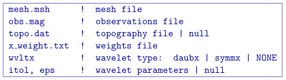
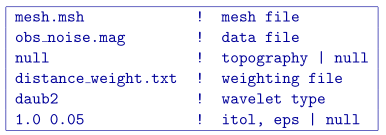

.. _mvisen:

MVISEN
======

This program performs the sensitivity calculation for magnetic vector inversion. Command line usage:

``mvisen mvisen.inp [nThreads]``

For a sample input file type:

``mvisen -inp``

The argument specifying the number of CPU threads used in the OpenMP format is optional. If this argument is not given to the program, chooses to use all of the CPU threads on the machine. This argument allows the user to specify half, for example, of the threads so that the program does not take all available RAM. Note that this option is not available in the MPI-based code used for clusters.

Input files
-----------

Format of the control file:

The input parameters for the control file are:

- ``mesh.msh``: Name of 3D :ref:`mesh file <meshFile>`.

- ``obs.mag``: The :ref:`data file <magFile>` that contains the observation locations. Note for sensitivity calculations, standard deviations are not required, but this file may be the observations that will be used in the inversion (with uncertainties).

- ``topo.dat``: Surface :ref:`topography <topoFile>`. If ``null`` is entered, the surface will be treated as being flat on top of the mesh.

- ``x_weight.txt``: A file (in the :ref:`model file format <modelFile>`) giving the sensitivity the weighting function. This can be user-specific or generated from :ref:`pfweight <pfweight>`. It does *not* have to specifically be named "distance_weight.txt" or "depth_weight.txt" (if :ref:`pfweight <pfweight>` was used, x = "depth" or "distance").

- ``wvltx``: A five-character string identifying the type of wavelet used to compress the sensitivity matrix. The types of wavelets available are Daubechies wavelet with 1 to 6 vanishing moments (``daub1``, ``daub2`` and so on) and Symmlets with 4 to 6 vanishing moments (``symm4``, ``symm5``, ``symm6``). Note that ``daub1`` is the Haar wavelet and ``daub2`` is the Daubechies-4 wavelet. The Daubechies-4 wavelet is suitable for most inversions, while the others are provided for user's experimentation. If ``NONE`` is entered, the program does not use wavelet compression.

- ``itol``, ``eps``: An integer and real number that specify how the wavelet threshold level is to be determined. This line is ignored if no wavelet compression is being used, however the line *must still* be in the input file. 

     ``itol=1``: program calculates the relative threshold and ``eps`` is the relative reconstruction error of the sensitivity. A reconstruction error of 0.05 (95%) is usually adequate. 

     ``itol=2``: the user defines the threshold level and ``eps`` is the threshold to be used. If ``null`` is entered on this line, a default relative reconstruction error of 0.05 (e.g. 5%) is used and the relative threshold level is calculated (i.e., ``itol=1`` , ``eps=0.05``).

Example of input file
~~~~~~~~~~~~~~~~~~~~~

Output files
------------

The program ``mvisen`` outputs five files. They are:

#. ``mviinv.mtx``: The sensitivity matrix file to be used in the inversion. This file contains the sensitivity matrix, generalized depth weighting function, mesh, and discretized surface topography. It is produced by the program and it's name is not adjustable. It is very large and may be deleted once the work is completed.

#. ``mvisen.log``: The log file produced by the program for the user's records on how the sensitivity matrix was formed including the full control file used.

#. ``sensitivity_x.txt``: This file is a :ref:`model file <modelFile>` that contains the average sensitivity for the *Easting* component magnetization vector for each cell. This file can be used for depth of investigation analysis or for use in designing special model objective function weighting.
   
#. ``sensitivity_y.txt``: This file is a :ref:`model file <modelFile>` that contains the average sensitivity for the *Northing* component magnetization vector for each cell. This file can be used for depth of investigation analysis or for use in designing special model objective function weighting.
   
#. ``sensitivity_z.txt``: This file is a :ref:`model file <modelFile>` that contains the average sensitivity for the *vertical* component magnetization vector for each cell. This file can be used for depth of investigation analysis or for use in designing special model objective function weighting.

