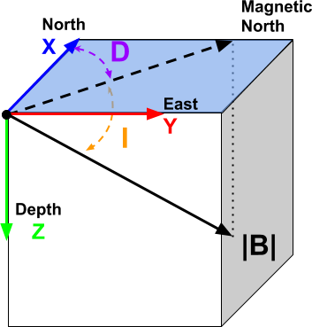
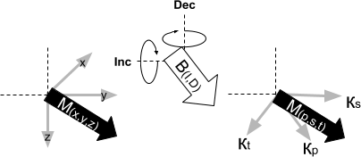

Background theory
=================

Introduction
------------

Here we present the theoretical background of the magnetic problem, numerical examples, and
details regarding the algorithms used by the MVI program library. This suite of
algorithms, developed at the UBC-Geophysical Inversion Facility, is used to
invert magnetic responses over a three-dimensional vector magnetization model. The
manual is designed to help geophysicist who may be familiar with the magnetic
experiment but not necessarily versed in the details of inverse
theory.

.. note:: For more general information about the magnetic experiment, the reader is invited to visit the `GPG site <https://gpg.geosci.xyz>`_

Magnetic Data
-------------

Magnetic survey data are generally comprised of a set of total magnetic intensity (TMI)
measurements acquired above the Earth's surface; although borehole data are sometime collected. The observed magnetic datum :math:`b^{TMI}` can be written as:

.. math:: b^{TMI} =   |\mathbf{B}_0 + \mathbf{B}_A|

where both the Earth's field :math:`\mathbf{B}_0` and the anomalous fields :math:`\mathbf{B}_A` from magnetized bodies
are recorded. The goal of the magnetic inversion is to obtain information
about the distribution of subsurface magnetization from the data. The assumption is usually made that the anomalous field is small compared to
Earth's field, thus the following is true:

.. math::
    \mathbf{B}_A \approx (\mathbf{B}_A \cdot \mathbf{\hat B}_0)\; \mathbf{\hat B}_0
    :label: projBa

where :math:`\bf{\hat B}_0` is the unit vector in the direction of Earth's field.
The Total Magnetic Anomaly can therefore be defined as

.. math:: {b^{TMA}} = b^{TMI} - |\mathbf{B}_0|\;,

.. figure:: ../images/TMI_anomaly.png
    :align: center
    :figwidth: 50%

Forward modelling
-----------------

General formulation
~~~~~~~~~~~~~~~~~~~

The anomalous field produced by a distribution of magnetization
:math:`\mathbf{M}` is given by the following integral equation, where the integrand is comprised of a dyadic
Green's function:

.. math::
   \mathbf{B}_A(\mathbf{r})=\frac{\mu_0}{4\pi}\int\limits_V \nabla \nabla \frac{1}{\left |\mathbf{r}-\mathbf{r}_0\right |}\cdot\mathbf{M} \; dv,
   :label: greensf

where :math:`\mathbf{r}` is the observation location and
:math:`V` represents the volume of magnetization at source locations
:math:`\mathbf{r}_0`. The above equation is valid for observation locations
above the earth's surface; i.e. outside the region of magnetization.

The total magnetization exhibited by a rock :math:`\mathbf{M}` is comprised of three components:

.. math::
	\mathbf{M} = \kappa \left( \mathbf{H}_0 + \mathbf{H}_s \right) + \mathbf{M}_r\;,
	:label: magnetization

where :math:`\boldsymbol{\kappa}` is the magnetic susceptibility of the rock, :math:`\mathbf{H_0}` is the Earth's primary field, :math:`\mathbf{H_s}` represents any ambient secondary (self-demagnetizing) fields and :math:`\mathbf{M_r}` represents the contribution due to magnetic remanence. The total induced magnetization is given by :math:`\boldsymbol{\kappa (H_0 + H_s)}`.

The magnetization of an object produces a magnetic flux.
Outside the magnetized body, the magnetic flux density :math:`\mathbf{B}` and the magnetic field :math:`\mathbf{H}` are related by the magnetic permeability of free-
space  :math:`\mu_0` such that:

.. math:: \mathbf{H}=\mathbf{B} / \mu_0

When the susceptibility is constant within a volume of source region, the
Eq. :eq:`greensf` can be written in matrix form as:

.. math::
   \mathbf{B}_A=\mu_0\left( \begin{array}{ccc}
   T_{11} & T_{12} & T_{13} \\
   T_{21} & T_{22} & T_{23}\\
   T_{31} & T_{32} & T_{33}
   \end{array} \right)\mathbf{M} \equiv \mu_0\mathbf{T}\mathbf{M}.
   :label: bmatrix

The tensor :math:`\mathbf{T}_{ij}` is given by

.. math::
    \mathbf{T}_{ij}=\frac{1}{4\pi}\int\limits_V\frac{\partial}{\partial x_i}\frac{\partial}{\partial x_j}\frac{1}{\left |\mathbf{r}-\mathbf{r}_0\right |}dv, \mbox{  for }i=1,3 ; j=1,3,
    :label: tij

where :math:`x_1`, :math:`x_2`, and :math:`x_3` represent :math:`x-, y-`,
and :math:`z-`\ directions, respectively. The expressions of
:math:`\mathbf{T}_{ij}` for a cuboidal source volume can be found in
:cite:`Bhattacharyya64` and :cite:`Sharma66`. Since :math:`\mathbf{T}` is
symmetric and its trace is equal to :math:`-1` when the observation is inside
the cell and is :math:`0` when the observation is outside the cell, only five
independent elements need to be calculated.

Once :math:`\mathbf{T}` is formed, the magnetic anomaly :math:`\mathbf{B}_A` is easily obtained. Furthermore, its projection along any measurement direction is easily obtained by taking the inner product with the directional vector. The projection of the field
:math:`\mathbf{B}_A` along different directions yields different anomalies
commonly obtained in magnetic surveys. For instance, the vertical anomaly
is simply :math:`B_{A_z}`, the vertical component of :math:`\mathbf{B}_A`,
whereas the total field anomaly is, to first order, the projection of
:math:`\mathbf{B}_A` onto the direction of the inducing field
:math:`\mathbf{B}_0`.

Numerical implementation of forward modelling
~~~~~~~~~~~~~~~~~~~~~~~~~~~~~~~~~~~~~~~~~~~~~

    Right-hand coordinate system, *z*-axis positive down.

We use a right-handed coordinate system with *z*-axis pointing down. By
equation :eq:`magnetization`, we divide the region of interest into a set of
3D prismatic cells and assume a constant magnetization within each cell from
which we calculate the total anomalous field using equations :eq:`projBa` and
:eq:`bmatrix`. As input parameters within the `data file <http://giftoolscookbook.
readthedocs.io/en/latest/content/fileFormats/magfile.html>`_, the coordinates, inclination and declination of the anomaly
direction must be specified for each datum.

We can define the magnetization vector in terms of an *effective susceptibility*
:math:`\boldsymbol \kappa_e` along the Cartesian directions such that

.. math::
  \mathbf{M} = {H}_0 \boldsymbol \kappa_e

and

.. math::
  \boldsymbol \kappa_e = \left[ \begin{array}{c} \boldsymbol \kappa_x \\ \boldsymbol \kappa_y \\ \boldsymbol \kappa_z \end{array} \right]

Let the set of extracted anomaly data be :math:`\mathbf{d} =
(d_1,d_2,...,d_N)^T` and the effective susceptibilities of cells in the model be
:math:`\boldsymbol \kappa_e = (\kappa_{x_1},\kappa_{x_2},...,\kappa_{z_M})^T`. The two are related by
the forward matrix

.. math::
   \mathbf{d}=\mathbf{G}{\boldsymbol{\mathbf{m}}}.
   :label: sens

The matrix has elements :math:`g_{ij}` which quantify the contribution to the
:math:`i^{th}` datum due to a unit susceptibility in the :math:`j^{th}` cell.
The calculation involves the evaluation of equation :eq:`tij` in a 3D
rectangular domain defined by each cell. This operation can be done by
``MAGFWR3D`` if only the data is required, or by ``MAGSEN3D`` if the forward
matrix is stored on disk for the inversion. The :math:`G` matrix provides the
forward mapping from the model to the data during the entire inverse process.
We will discuss its efficient representation via the wavelet transform in a
separate section.

.. _invMethod:

Inversion methodology
---------------------

The inverse problem is formulated as an optimization problem where a global
objective function, :math:`\phi`, is minimized subject to the constraints in
equation :eq:`sens`. The global objective functions consists of two
components: a model objective function, :math:`\phi_m`, and a data misfit
function, :math:`\phi_d`, such that

.. math::
   \begin{aligned}
   \min \phi = \phi_d+\beta\phi_m \\
   \mbox{s. t. } \mathbf{m}^l\leq \mathbf{m} \leq \mathbf{m}^u, \nonumber\end{aligned}
   :label: globphi

where :math:`\beta` is a trade off parameter that controls the relative
importance of the model smoothness through the model objective function and
data misfit function. When the standard deviations of data errors are known,
the acceptable misfit is given by the expected value :math:`\phi_d` and we
will search for the value of :math:`\beta` via an L-curve criterion
:cite:`Hansen00` that produces the expected misfit. Otherwise, a user-defined
:math:`\beta` value is used. Bounds are imposed through the projected gradient
method so that the recovered model lies between imposed lower
(:math:`\mathbf{m}^l`) and upper (:math:`\mathbf{m}^u`) bounds.

In discrete matrix form, the objective function in :eq:`globphi` can be
written as

.. math::
  \phi = \phi_d + \beta \phi_m
  = \| \mathbf{W}_d (\mathbb{F}(\mathbf{m}) - \mathbf{d}^{obs})\|_2^2 +\beta \sum_{i = s,x,y,z}  {\|\mathbf{W_i}(\mathbf{m-m_{ref}})\|}^2_2 \;,

where :math:`\mathbf{W}_i` are functions measuring the deviation of the model
:math:`\mathbf{m}` from a reference :math:`\mathbf{m_{ref}}` or the roughness
measured along three orthogonal directions. The following sections provide
additional details about the :ref:`misfit<misfit>` and the
:ref:`regularization<regularization>` function.

.. _misfit:

Misfit function :math:`\phi_d`
------------------------------

The first term in :eq:`globphi` defines a measure of how well
the observed data are reproduced by a model :math:`\mathbf{m}`. Here we use the :math:`l_2`-norm measure

.. math::
    \begin{aligned}
    \phi_d = \left\| \mathbf{W}_d(\mathbb{F}(\mathbf{m})-\mathbf{d})\right\|^2.\end{aligned}
    :label: phid

For the work here, we assume that the contaminating noise on the data is
independent and Gaussian with zero mean. Specifying :math:`\mathbf{W}_d` to be
a diagonal matrix whose :math:`i^{th}` element is :math:`1/\sigma_i`, where
:math:`\sigma_i` is the standard deviation of the :math:`i^{th}` datum, makes
:math:`\phi_d` a chi-squared distribution with :math:`N` degrees of freedom.
The optimal data misfit for data contaminated with independent, Gaussian noise
has an expected value of :math:`E[\chi^2]=N`, thus providing a target misfit for
the inversion. We now have the components to solve the inversion as defined in
equation :eq:`globphi`.

To solve the optimization problem when constraints are imposed we use the
projected gradients method :cite:`CalamaiMore87,Vogel02`. This technique
forces the gradient in the Krylov sub-space minimization (in other words a
step during the conjugate gradient process) to zero if the proposed step would
make a model parameter exceed the bound constraints. The result is a model
that reaches the bounds, but does not exceed them.

.. This method is
.. computationally faster than the log-barrier method because (1) model
.. parameters on the bounds are neglected for the next iteration and (2) the log-
.. barrier method requires the calculation of a barrier term. Previous versions
.. of MAG3D used the logarithmic barrier method :cite:`Wright97,NocedalWright99`.

.. The weighting function is generated by the program that is in turn given as
.. input to the sensitivity generation program MAGSEN3D. This gives the user full
.. flexibility in using customized weighting functions. This program allows user
.. to specify whether to use a generalized depth weighting or a distance-based
.. weighting that is useful in regions of largely varying topography. Distance
.. weighting must be used when borehole data are present.

Sensitivities
~~~~~~~~~~~~~

A solution to :eq:`globphi` is found by the second order Gauss-Newton method, such
that a model update is calculated by iteratively solving

.. math::
  \frac{\partial \phi(\mathbf{m})}{\partial \mathbf{m}} = \mathbf{J^T W_\text{d}^T W_\text{d}} \left[ \mathbb{F}(\mathbf{m}) -\mathbf{d}^{obs} \right]+ \beta \mathbf{W^T} \mathbf{W}  ( \mathbf{m} - \mathbf{m_{ref}}) \\
  :label: GaussNewton

where :math:`\mathbf{J}`, also known as the *sensitivity* matrix, holds the
derivatives of the forward operation with respect to the *model*

.. math::
  \mathbf{J} = \frac{\partial \mathbb{F}(\mathbf{m})}{\partial \mathbf{m}}

The first question that arises during the inversion of magnetic data concerns the
definition of the "model". The MVI program allows for the inversion of a magnetization vector defined in
either Cartesian or Spherical coordinate systems :cite:`LelievrePhD`. We define both systems below.

.. _MVIC:

Cartesian (PST)
"""""""""""""""

The first choice is to define a model :math:`\mathbf{m}` in terms of effective
magnetic susceptibility :math:`\boldsymbol \kappa_e` along a rotated coordinate
system such that one of the components is aligned with the inducing field
:math:`\mathbf{H}_0`. Thus

.. math::
  \mathbf{M} = |{H}_0| \left[ \begin{array}{c} \boldsymbol \kappa_p \\ \boldsymbol \kappa_s \\ \boldsymbol \kappa_t \end{array} \right]\\
  \boldsymbol \kappa_{pst} = \Omega_\phi \Omega_\theta \boldsymbol \kappa_{xyz}

where *p* (primary), *s* (secondary) and *t* (tertiary) defines an
orthogonal system that describes the magnetization vector in 3D. The matrices
:math:`\Omega_\theta` and :math:`\Omega_\phi` define the rotation around the *z*-axis and *y*-axis respectively so that the
*x*-axis points along the inducing field direction.

    Cartesian PST rotated coordinate system.

The sensitivity matrix :math:`\mathbf{J}` simplifies to

.. math::
  \mathbf{J} = \frac{\partial \mathbb{F}(\mathbf{m})}{\partial \mathbf{m}} =  \mathbf{\tilde G} \\
  \mathbf{\tilde G} = \mathbf{G} \Omega_\phi \Omega_\theta

The main advantage of this formulation is that the inversion remains linear.
The drawback is that both the direction and the magnitude of magnetization are
coupled in the vector components, which makes it harder to impose constraints
on the magnetization vector through sparsity and/or petrophysical constraints.

.. _MVIS:

Spherical (ATP)
"""""""""""""""

As an alternative to the Cartesian formulation, the magnetization vector can be
expressed in terms of an amplitude (:math:`\alpha`) and two orientation angles
(:math:`\theta,\;\phi`) (ATP).

.. _trig:
.. math::
  x =& \alpha \; cos(\phi)\;cos(\theta) \\
  y  =   & \alpha \; cos(\phi)\;sin(\theta) \\
  z = & \alpha \; sin(\phi)
  :label: trig

.. figure:: ../images/Magnetization_Spherical.png
    :align: center
    :figwidth: 50%

    Spherical (ATP) coordinate system.

The sensitivity matrix becomes non-linear due to the trigonometric
transformation such that

.. math::
  \mathbf{J} = \frac{\partial \mathbb{F}(\mathbf{m})}{\partial \mathbf{m}} = \mathbf{G}\;\mathbf{S}

where the matrix :math:`\mathbf{S}` holds the partial derivatives of :eq:`trig`

.. math::
  \mathbf{S} = \begin{bmatrix} \cos{\phi}\cos{\theta} & -\alpha\sin{\phi}\cos{\theta} & -\alpha\cos{\phi}\sin{\theta} \\
  \cos{\phi}\sin{\theta} & -\alpha\sin{\phi}\sin{\theta} & \alpha\cos{\phi}\cos{\theta} \\
  \sin{\phi} & \alpha\cos{\phi} & 0 \end{bmatrix}

Up until recently, solving the spherical formulation had proven to be
prohibitively difficult. Issues regarding the convergence of the non-linear
problem have now been addressed through an automated sensitivity re-weighting
strategy.

Solving for model parameters in spherical coordinates comes with the increased
flexibility, as the user constrains the amplitude and orientation
independently. The reader is encouraged to visit the :ref:`examples<examples>`
section.

.. _regularization:

Regularization
~~~~~~~~~~~~~~

We next discuss the construction of a model objective function which, when
minimized, produces a model that is geophysically interpretable. This function
gives the flexibility to incorporate as little or as much information as
possible. At minimum, it drives the solution towards a reference model
:math:`\mathbf{m}_0` and requires that the model be relatively smooth in the three
spatial directions. Let the model objective function expressed as

.. _mof:
.. math::
   \phi_m(\mathbf{m}) = \alpha_s\int\limits_V w_s\left\{w(\mathbf{r})[\mathbf{m}(\mathbf{r})-{\mathbf{m_{ref}}}] \right\}^2dv \;+\\
    \sum_{i=x,y,z} \alpha_i\int\limits_V w_i \left\{\frac{\partial w(\mathbf{r})[\mathbf{m}(\mathbf{r})-{\mathbf{m_{ref}}}]}{\partial i}\right\}^2dv \\ \nonumber
   :label: mof

where the functions :math:`w_s`, :math:`w_x`, :math:`w_y` and :math:`w_z` are
spatially dependent, while :math:`\alpha_s`, :math:`\alpha_x`,
:math:`\alpha_y` and :math:`\alpha_z` are coefficients which affect the
relative importance between the *smallness* and three *smoothness* functions. The
reference model is given as :math:`\mathbf{m_{ref}}` and :math:`w(\mathbf{r})` is
a generalized sensitivity weighting function. The purpose of this function is to
counteract the geometrical decay of the sensitivities with respect to the distances from the
observation locations. The details of the
sensitivity weighting function will be discussed in the :ref:`next section<sensWeight>`.

.. The objective function in equation :eq:`mof` has the flexibility to
.. incorporate many types of prior knowledge into the inversion. The reference
.. model may be a general background model that is estimated from previous
.. investigations or it will be a zero model. The reference model would generally
.. be included in the first component of the objective function but it can be
.. removed, if desired, from the remaining terms; often we are more confident in
.. specifying the value of the model at a particular point than in supplying an
.. estimate of the gradient. The choice of whether or not to include
.. :math:`\mathbf{m}_0` in the derivative terms can have significant effect on
.. the recovered model as shown through the synthetic example (section
.. [RefModSection]). The relative closeness of the final model to the reference
.. model at any location is controlled by the function :math:`w_s`. For example,
.. if the interpreter has high confidence in the reference model at a particular
.. region, he can specify :math:`w_s` to have increased amplitude there compared
.. to other regions of the model, thus favouring a model near the reference model
.. in those locations. The weighting functions :math:`w_x`, :math:`w_y`, and
.. :math:`w_z` can be designed to enhance or attenuate gradients in various
.. regions in the model domain. If geology suggests a rapid transition zone in
.. the model, then a decreased weighting on particular derivatives of the model
.. will allow for higher gradients there and thus provide a more geologic model
.. that fits the data.

Numerically, the model objective function in equation Eq. :eq:`mof` is discretized
onto the mesh defining the effective susceptibility model using a finite difference
approximation. This yields:

.. math::
    \phi_m({\mathbf{m}}) = \alpha_s \| \mathbf{W}_s \mathbf{R_s} ({\mathbf{m}}-{\mathbf{m_{ref}}})\|_2^2 + \sum_{i=x,y,z} \alpha_i \| \mathbf{W}_i \mathbf{R_i} \mathbf{G}_i (\mathbf{m}-\mathbf{m_{ref}}),
    :label: modobjdiscr

where :math:`\mathbf{m}` and :math:`\mathbf{m}_0` are vectors of length :math:`3M`
representing the recovered and reference models, respectively. The individual
matrices :math:`\mathbf{W}_s`, :math:`\mathbf{W}_x`, :math:`\mathbf{W}_y`, and
:math:`\mathbf{W}_z` contain *user-defined* weights as well as the
sensitivity weighting functions :math:`w(\mathbf{r})`. The gradient matrices
:math:`\mathbf{G}_x`, :math:`\mathbf{G}_y` and :math:`\mathbf{G}_z` are finite
difference operators measuring the change in model values.

.. important::
  **Change from previous versions** - The difference operators :math:`\mathbf{G_i}` are now unitless, removing the need to alter scaling between the *smallness*
  and *smoothness* terms. By default, :math:`\alpha_s`, :math:`\alpha_x`, :math:`\alpha_y` and :math:`\alpha_z` = 1

.. _sensWeight:

Sensitivity Weighting
----------------------

It is a well-known fact that static magnetic data have no inherent depth
resolution. Thus when an inversion is
performed which minimizes :math:`\int m(\mathbf{r})^2 dv` subject to fitting
the data, the constructed susceptibility is concentrated close to the
observation locations. This is a direct manifestation of the kernel's decay
with respect to the distance between the cell and observation locations. Because of the
rapidly diminishing amplitude, the kernels of magnetic data are not sufficient
to generate a function that possess significant structure at locations that
are far away from observations.

Moreover, the :ref:`trigonometric transformation<trig>` associated
with the spherical formulation introduces rapid changes in the sensitivity
function, which affects the convergence of the algorithm.

In order to overcome these issues, we opt for an iterative re-weighting of the
regularization to adjust the relative influence of the misfit and
regularization functions. While previous version of the ``MAG3D`` and ``MVI``
made use of a depth or distance weighting, in this version we calculate the
weights directly from the sensitivity matrix. We define the sensitivity
weights as follow:

.. math::
  \mathbf{W_r} &= diag \left( {\left[{\mathbf{\hat w_r}}\right]}^{1/2}\right)\\
  \mathbf{\hat w_{r}} &= \frac{\mathbf{ w_{r}}}{max(\mathbf{ w_{r}})}\\
  w_{r_j} &= {\left[\sum_{i=1}^{nD}{J^{(k)}_{ij}}^2 + \delta \right]}^{1/2}\;,
  :label: SensWeights

where the superscript :math:`(k)` is an iteration index and :math:`\delta` is
a small number added to avoid singularity.

.. _waveletSection:

Wavelet Compression of Sensitivity Matrix
-----------------------------------------

The two major obstacles to the solution of a large-scale magnetic inversion
problem are the large amount of memory required for storing the sensitivity
matrix and the CPU time required for the application of the sensitivity matrix
to model vectors. This program library overcomes these difficulties by forming
a sparse representation of the sensitivity matrix using a wavelet transform
based on compactly supported, orthonormal wavelets. For more details, the
users are referred to :cite:`LiOldenburg03,LiOldenburg10`. Here, we give a
brief description of the method necessary for the use of the MVI library.

Each row of the sensitivity matrix in a 3D magnetic inversion can be treated
as a 3D image and a 3D wavelet transform can be applied to it. By the
properties of the wavelet transform, most transform coefficients are nearly or
identically zero. When coefficients of small magnitude are discarded (the
process of thresholding), the remaining coefficients still contain much of the
necessary information to reconstruct the sensitivity accurately. These
retained coefficients form a sparse representation of the sensitivity in the
wavelet domain. The need to store only these large coefficients means that the
memory requirement is reduced. Furthermore, the multiplication of the sensitivity
with a vector can be carried out by a sparse multiplication in the wavelet
domain. This greatly reduces the CPU time. Since the matrix-vector
multiplication constitutes the core computation of the inversion, the CPU time
for the inverse solution is reduced accordingly. The use of this approach
increases the size of solvable problems by nearly two orders of magnitude.

Let :math:`\mathbf{G}` be the sensitivity matrix and :math:`\mathcal{W}` be the symbolic matrix-representation of the 3D wavelet transform. Applying transform to each row of :math:`\mathbf{G}`, and forming a new matrix consisting of rows of transformed sensitivity, is equivalent to the following operation:

.. math::
   \widetilde{\mathbf{G}}=\mathbf{G}\mathcal{W}^T,
   :label: senswvt

where :math:`\widetilde{\mathbf{G}}` is the transformed matrix. The thresholding is applied to individual rows of :math:`\mathbf{G}` by the following rule to form the sparse representation :math:`\widetilde{\mathbf{G}}^S`,

.. math::
   \widetilde{g}_{ij}^{s}=\begin{cases}
   \widetilde{g}_{ij} & \mbox{if } \left|\widetilde{g}_{ij}\right| \geq \delta _i \\
   0 & \mbox{if } \left|\widetilde{g}_{ij}\right| < \delta _i
   \end{cases}, ~~ i=1,\ldots,N,
   :label: elemg

where :math:`\delta _i` is the threshold level, and :math:`\widetilde{g}_{ij}` and :math:`\widetilde{g}_{ij}^{s}` are the elements of :math:`\widetilde{\mathbf{G}}` and :math:`\widetilde{\mathbf{G}}^S`, respectively. The threshold levels :math:`\delta _i` are determined according to the allowable error of the reconstructed sensitivity, which is measured by the ratio of norm of the error in each row to the norm of that row, :math:`r_i(\delta_i)`. It can be evaluated directly in the wavelet domain by the following expression:

.. math::
    r_i(\delta_i)=\sqrt{\frac{\underset{\left | {\widetilde{g}_{ij}} \right| <\delta_i}\sum{\widetilde{g}_{ij}}^2}{\underset{j}\sum{\widetilde{g}_{ij}^2}}}, ~~i=1,\ldots,N,
    :label: rhoi

Here the numerator is the norm of the discarded coefficients and the
denominator is the norm of all coefficients. The threshold level
:math:`\delta_{i_0}` is calculated on a representative row, :math:`i_0`. This
threshold is then used to define a relative threshold :math:`\epsilon
=\delta_{i_{o}}/ \underset{j}{\max}\left | {\widetilde{g}_{ij}} \right |`. The
absolute threshold level for each row is obtained by

.. math::
   \delta_i = \epsilon \underset{j}{\max}\left | {\widetilde{g}_{ij}} \right|, ~~i=1,\ldots,N.
   :label: deltai

The program that implements this compression procedure is MVISEN. For
experienced users, the program allows the direct input of the relative
threshold level. However it is recommended newer users let the program determine the optimal
compression accuracy.
